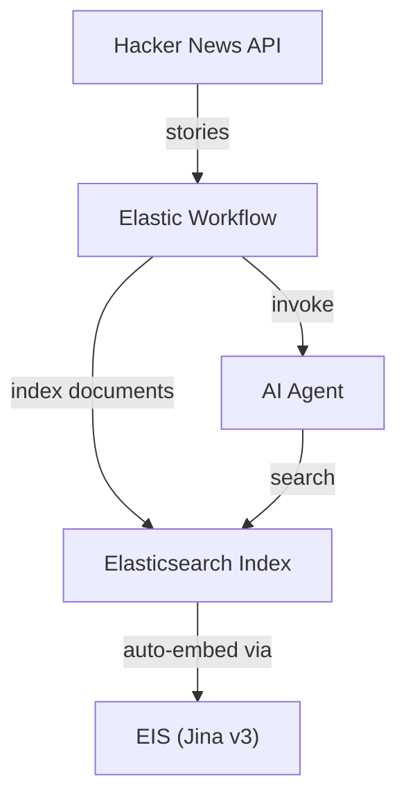
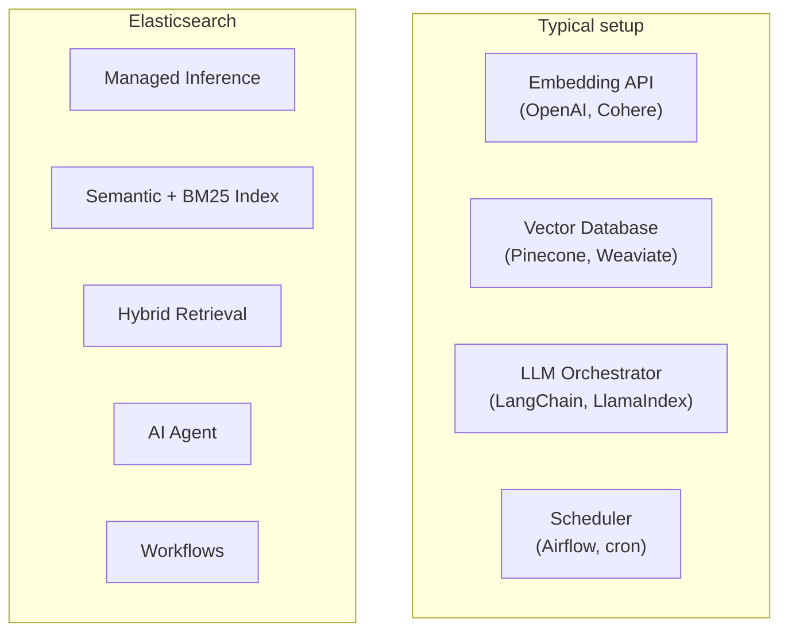
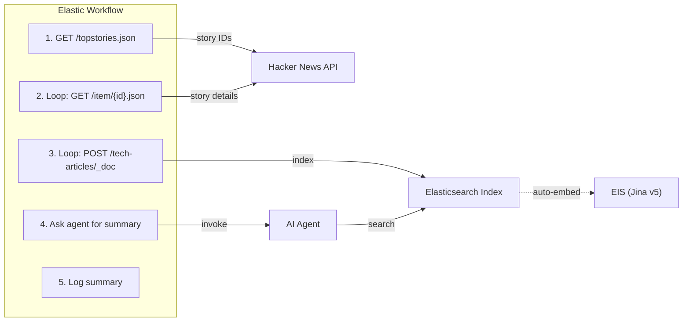

```mermaid
graph TD
    HN["Hacker News API"] -->|stories| WF["Elastic Workflow"]
    WF -->|index documents| ES["Elasticsearch Index"]
    ES -->|auto-embed via| EIS["EIS (Jina v3)"]
    WF -->|invoke| Agent["AI Agent"]
    Agent -->|search| ES
```

```mermaid
graph TD
    subgraph "Typical setup"
        A["Embedding API
         (OpenAI, Cohere)"]
        B["Vector Database
        (Pinecone, Weaviate)"]
        D["LLM Orchestrator
        (LangChain, LlamaIndex)"]
        E["Scheduler
        (Airflow, cron)"]
    end

    subgraph "Elasticsearch"
        F["Managed Inference"]
        G["Semantic + BM25 Index"]
        H["Hybrid Retrieval"]
        I["AI Agent"]
        J["Workflows"]
    end
```

```mermaid
graph LR
    subgraph "Elastic Workflow"
        S1["1. GET /topstories.json"]
        S2["2. Loop: GET /item/{id}.json"]
        S3["3. Loop: POST /tech-articles/_doc"]
        S4["4. Ask agent for summary"]
        S5["5. Log summary"]
    end

    HN["Hacker News API"]
    ES["Elasticsearch Index"]
    EIS["EIS (Jina v5)"]
    Agent["AI Agent"]

    S1 -->|story IDs| HN
    S2 -->|story details| HN
    S3 -->|index| ES
    ES -.->|auto-embed| EIS
    S4 -->|invoke| Agent
    Agent -->|search| ES
```