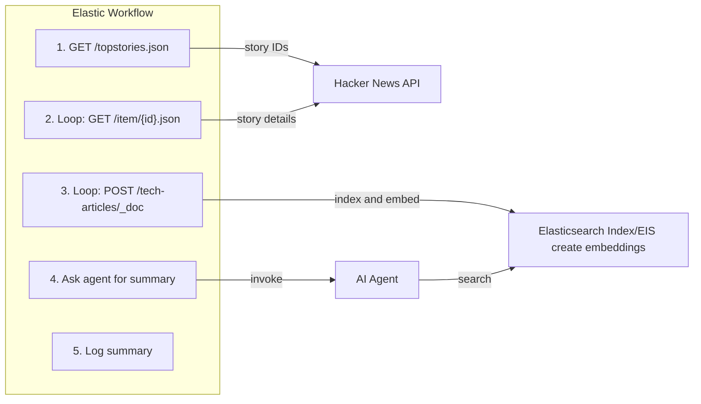
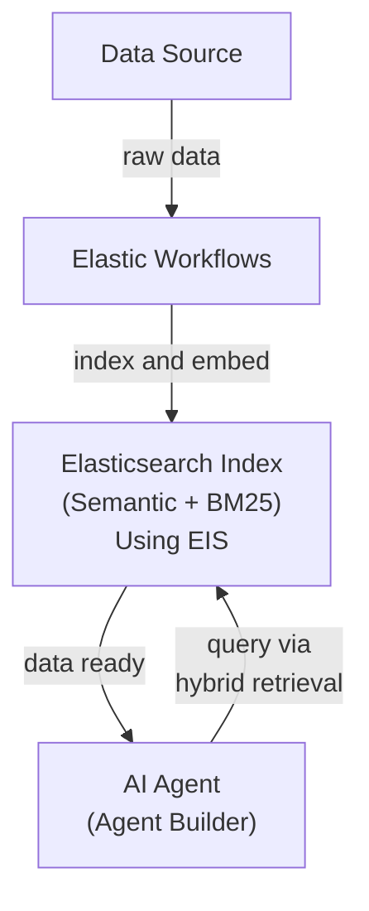

```mermaid
graph LR
    subgraph "Elastic Workflow"
        S1["1. GET /topstories.json"]
        S2["2. Loop: GET /item/{id}.json"]
        S3["3. Loop: POST /tech-articles/_doc"]
        S4["4. Ask agent for summary"]
        S5["5. Log summary"]
    end

    HN["Hacker News API"]
    ES["Elasticsearch Index/EIS create embeddings"]
    Agent["AI Agent"]

    S1 -->|story IDs| HN
    S2 -->|story details| HN
    S3 -->|index and embed| ES
    S4 -->|invoke| Agent
    Agent -->|search| ES
```

```mermaid
graph TD
    DS["Data Source"] -->|raw data| WF["Elastic Workflows"]
    WF -->|index and embed| ES["Elasticsearch Index
    (Semantic + BM25)
    Using EIS"]
    ES -->|data ready| Agent["AI Agent
    (Agent Builder)"]
    Agent -->|query via
    hybrid retrieval| ES
```

